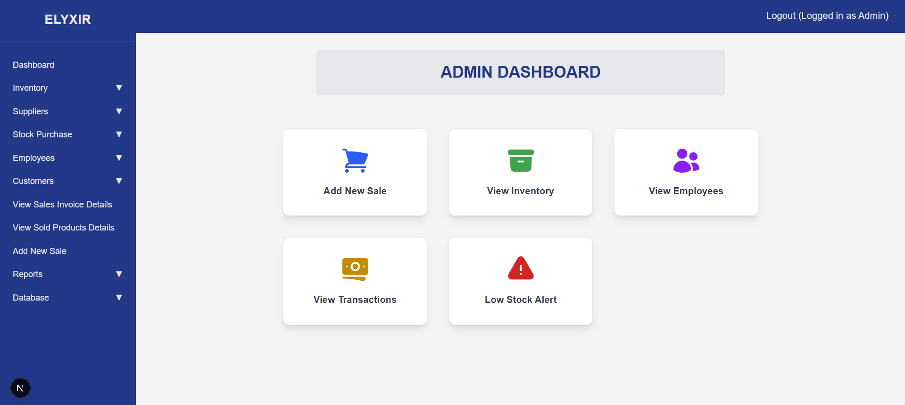
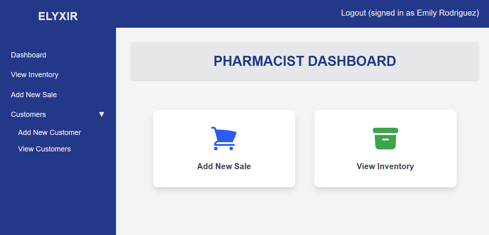
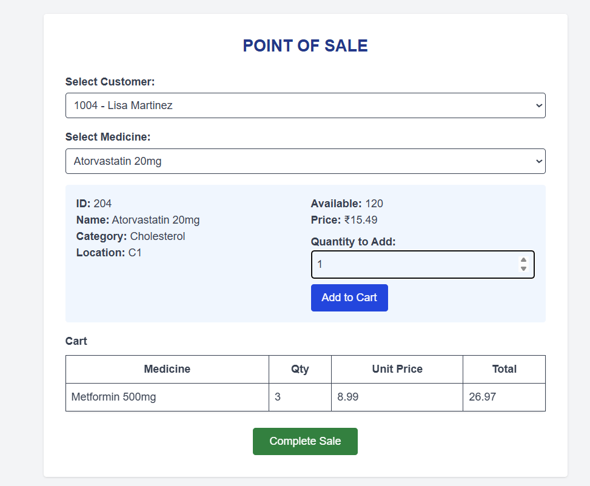
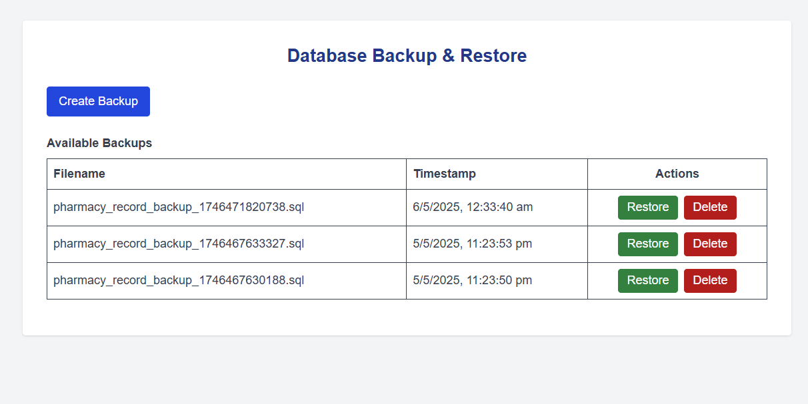
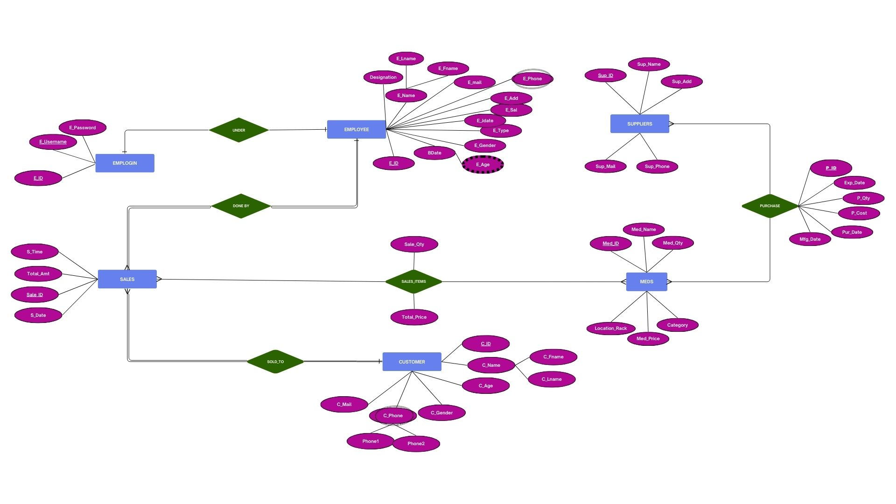

# 💊 Pharmacy Management System

A modern, full-featured Pharmacy Management System built with **Next.js (App Router)**, **MySQL**, and **TypeScript**.  
It supports inventory, sales, purchases, employees, suppliers, and customer management with **role-based dashboards** for Admin and Pharmacist.

---

## 🚀 Features

### 🧑‍💼 Admin Dashboard
- Manage medicines, suppliers, purchases, employees, and customers
- Access sales reports, low stock alerts, and transaction analytics

### 👨‍⚕️ Pharmacist Dashboard
- View real-time inventory
- Add new sales
- Add/search customers

### 🔐 Authentication
- Secure login for Admin and Pharmacist roles using `emplogin` and `employee` tables

### 📦 Inventory Management
- Add, update, and search medicines
- Track stock levels

### 💰 Sales & Purchases
- Record and view transactions
- Track purchases from suppliers and sales to customers

### 🧍 Customer Management
- Add and search customer data

### 🏢 Supplier Management
- Add, update, and view suppliers

### 📊 Reports
- View sales performance, low stock alerts, and top-selling medicines

### 💾 Database Backup & Restore
- Admins can backup and restore the entire MySQL database

### 💻 UI & UX
- Responsive design using **Tailwind CSS**
- Icons powered by **Heroicons**
- Clean, minimal dashboard experience

---
## 🖼 Preview






---

## 🛠 Getting Started

### 1. Clone the Repository
```bash
git clone <your-repo-url>
cd <your-repo-folder>
```

### 2. Install Dependencies
```bash
npm install
```

### 3. Set Up the MySQL Database
- Create a new database or import `pharmacy_record.sql` in MySQL (e.g., pharmacy_record)

#### Tables include:
- customer
- emplogin
- employee
- meds
- purchase
- sales
- sales_items
- suppliers

### 4. Configure Environment Variables
Create a `.env` file in the root directory:

```env
DB_HOST=localhost
DB_USER=your_mysql_user
DB_PASS=your_mysql_password
DB_NAME=pharmacy_record
DB_PORT=3306
```

### 5. Start the Development Server
```bash
npm run dev
```
Visit http://localhost:3000 in your browser.

---

## 🔑 Usage
- Login with credentials from the emplogin table
- Role-based access for Admin and Pharmacist
- Secure session/cookie management for authentication
- Logout clears session state

---

## 🧬 Database Schema (Summary)

| Table                  | Purpose                           |
|------------------------|-----------------------------------|
| `customer`             | Customer details                  |
| `emplogin`             | Employee login credentials        |
| `employee`             | Employee info & designations      |
| `meds`                 | Medicines inventory               |
| `purchase`             | Purchase transactions             |
| `sales`                | Sales transactions                |
| `sales_items`          | Items in each sale                |
| `suppliers`            | Supplier details                  |

---

## 🖼 ER Diagram




## ⚠️ Notes

- Educational/demo use only – not ready for production without hardening  
- All table/column names match MySQL exactly (e.g., `Med_ID`, `C_ID`, etc.)  
- If you find a bug or have a feature request, open an issue or submit a PR!

---

## 📄 License

[MIT](LICENSE)

---

## ⭐ Support

If you find this project useful, give it a star! Your support means a lot.